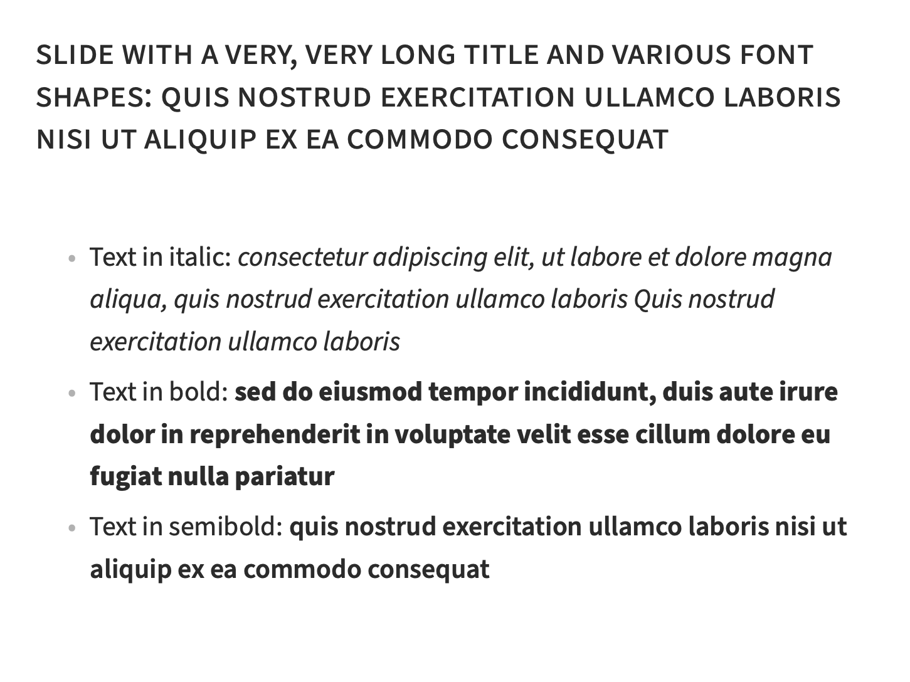
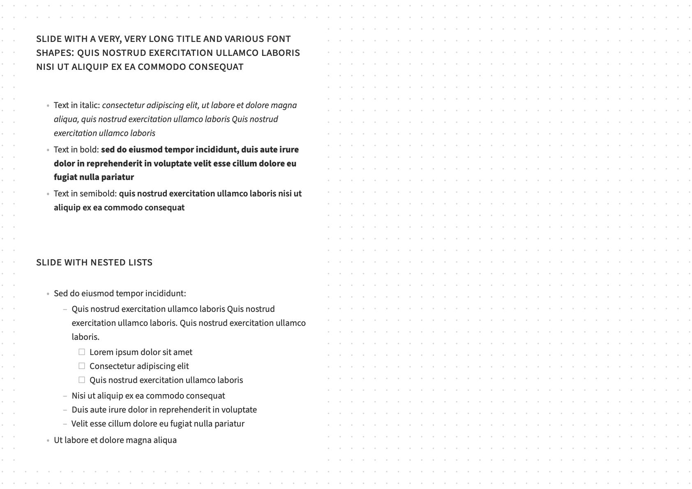
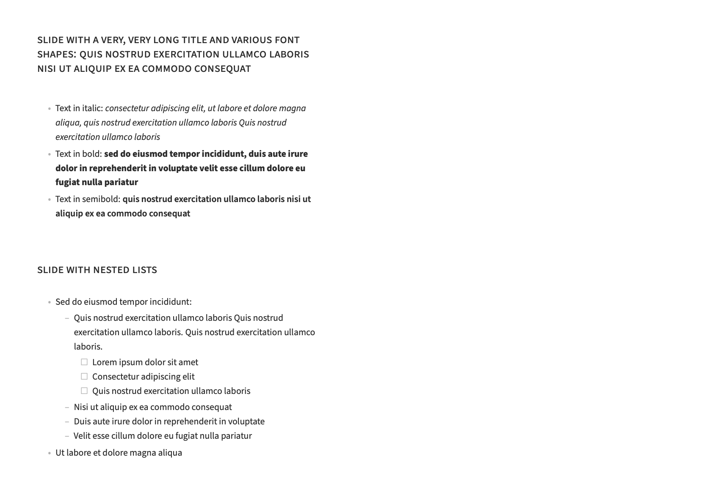

# pdf2note

**pdf2note** is a simple script that transforms your PDF documents—be it lecture notes, research papers, or books—into a 2-up layout specifically designed for enhanced note-taking.

The script rearranges your PDF so that each page of the output displays the original PDF content on the left side and a dedicated blank space on the right.
This layout is suitable for importing into note-taking applications like GoodNotes, Notability, or other similar platforms, allowing you to write, draw, or annotate directly alongside the source material.

|       Input PDF (Any Size)        |        Output PDF (A4 Landscape)        |
| :-------------------------------: | :-------------------------------------: |
|  |  |

## Prerequisites

Ensure that the `gs` (Ghostscript), `qpdf`, and `bc` commands are available in your system's PATH.

### Linux

Install `ghostscript` and `qpdf` from your distribution's package manager.
You might also need to install `bc`.

### MacOS (Homebrew)

```bash
brew install ghostscript qpdf
```

## Usage

Simply run `pdf2note abc.pdf` to generate `abc_note.pdf` for note-taking.

```
pdf2note [--no-grid] [--no-group] [--extra-interleaved] src.pdf [out.pdf]
```

### `--no-grid`

Use a clean white background instead of a grid paper background.

|             Without `--no-grid`             |            With `--no-grid`             |
| :-----------------------------------------: | :-------------------------------------: |
|  |  |

### `--no-group`

Instead of grouping multiple pages to fit the size, ensure each output page contains only one original page.

|            Without `--no-group`             |             With `--no-group`             |
| :-----------------------------------------: | :---------------------------------------: |
|  |  |

### `--extra-interleaved`

After generating the initial output, this option adds extra blank pages between each existing page.
This is particularly useful for creating additional note-taking space.

## License

This project is distributed under the MIT License. See the `LICENSE` file for more information.

## Source of Example Material

The example slides used in this documentation are from [pmichaillat/latex-presentation](https://github.com/pmichaillat/latex-presentation).
